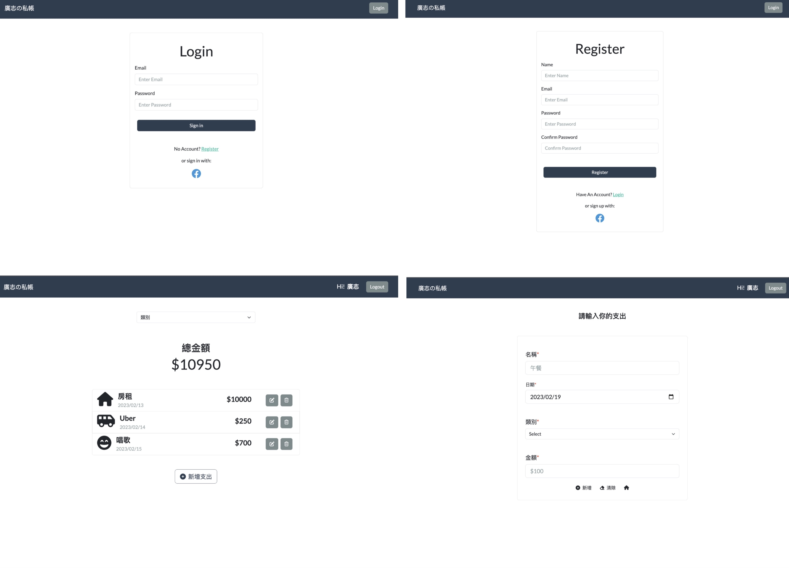

# expense-tracker

用 Node.js 打造的簡易記帳網頁！




## 功能描述 Features

* 查看所有支出列表及總金額
* 根據類別篩選支出，總金額的計算只會包括被篩選出來的支出總和
* 新增一筆支出
* 編輯一筆支出
* 刪除一筆支出
* 使用者可以登入、註冊帳號
* Facebook 帳號第三方登入


## 安裝與執行步驟 Installation and Execution
1. 請先確認有安裝 Node.js 與 npm
2. 打開終端機(Terminal)，將專案 clone 至本機位置

```
git clone https://github.com/abbie930/expense-tracker.git
```
3. 進入存放此專案的資料夾

```
cd expense-tracker
```
4. 安裝 npm 套件

```
npm install
```
5. 建立 .env 檔 (參照.env.example)

6. 載入種子資料

```
npm run seed
```
7. 執行

```
npm run dev
```
8. 若看見此行訊息則代表順利運行，打開瀏覽器進入到以下網址

```
Express is listening on http://localhost:3000
```
9. 若要暫停使用，則輸入

```
ctrl + c
```


## 環境建置與需求 Prerequisites

* Node.js 18.12.1
* Express 4.16.4
* MongoDB
* mongoose 5.9.7